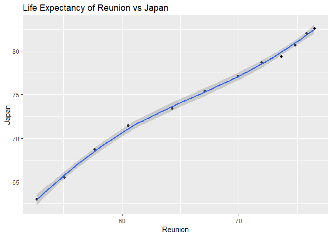

Homework \#4
================
Javier Castillo-Arnemann

First, as usual, we'll load the necessary packages:

``` r
library(gapminder)
library(knitr)
suppressPackageStartupMessages(library(tidyverse))
```

Activity 1
----------

*Make a tibble with one row per year and columns for life expectancy for two or more countries. Use `knitr::kable()` to make this table look pretty in your rendered homework. Take advantage of this new data shape to scatterplot life expectancy for one country against that of another.*

For this activity, we will choose the country with the highest average life expectancy in each continent and compare them.

We first create a dataframe that has the information for the countries with the highest average life expectancy.

``` r
max_life_exp_countries <- gapminder %>% 
  group_by(continent, country) %>%
  summarize(mean_lifeExp = mean(lifeExp)) %>%  #Get the mean life expectancy in each country
  filter(mean_lifeExp == max(mean_lifeExp)) #Get the highest life expectancy for each continent
```

Then we can use this dataframe's countries to filter the countries in the gapminder dataset:

``` r
spread_lifeExp <- gapminder %>%
  filter(country %in% max_life_exp_countries$country) %>% #Using the %in% operator to filter correctly
  select(year, country, lifeExp) %>%
  spread(key = country, value = lifeExp) 

kable(spread_lifeExp, align = "c") #Align values to the center
```

| year | Australia | Canada | Iceland |  Japan | Reunion |
|:----:|:---------:|:------:|:-------:|:------:|:-------:|
| 1952 |   69.120  | 68.750 |  72.490 | 63.030 |  52.724 |
| 1957 |   70.330  | 69.960 |  73.470 | 65.500 |  55.090 |
| 1962 |   70.930  | 71.300 |  73.680 | 68.730 |  57.666 |
| 1967 |   71.100  | 72.130 |  73.730 | 71.430 |  60.542 |
| 1972 |   71.930  | 72.880 |  74.460 | 73.420 |  64.274 |
| 1977 |   73.490  | 74.210 |  76.110 | 75.380 |  67.064 |
| 1982 |   74.740  | 75.760 |  76.990 | 77.110 |  69.885 |
| 1987 |   76.320  | 76.860 |  77.230 | 78.670 |  71.913 |
| 1992 |   77.560  | 77.950 |  78.770 | 79.360 |  73.615 |
| 1997 |   78.830  | 78.610 |  78.950 | 80.690 |  74.772 |
| 2002 |   80.370  | 79.770 |  80.500 | 82.000 |  75.744 |
| 2007 |   81.235  | 80.653 |  81.757 | 82.603 |  76.442 |

Now, let's plot some of this information. We will compare the life expectancies of Japan and Reunion.

``` r
spread_lifeExp%>%
  ggplot(aes(Reunion, Japan)) +
  geom_point() +
  labs(title = "Life Expectancy of Reunion vs Japan") +
  geom_smooth()
```

    ## `geom_smooth()` using method = 'loess' and formula 'y ~ x'



This plot is a good example of an important concept in statistics: correlation does not imply causation. Even though there is a strong correlation between the life expectancies in Japan and Reunion, it is highly unlikely that one is the direct cause for the other.

Activity 2
----------

*Create your own cheatsheet patterned after Jenny’s but focused on something you care about more than comics!*

For this activity, I created two small `.csv` files that contain some information about Major League Baseball (MLB) players and teams. We'll start by importing this data to R.

``` r
mlb_players <- read_csv("mlb_players.csv")
```

    ## Parsed with column specification:
    ## cols(
    ##   player = col_character(),
    ##   team = col_character(),
    ##   position = col_character()
    ## )

``` r
mlb_teams <- read_csv("mlb_teams.csv")
```

    ## Parsed with column specification:
    ## cols(
    ##   team = col_character(),
    ##   league = col_character(),
    ##   division = col_character()
    ## )

``` r
kable(mlb_players)
```

| player          | team      | position |
|:----------------|:----------|:---------|
| Mookie Betts    | Red Sox   | RF       |
| Aaron Judge     | Yankees   | RF       |
| Blake Snell     | Rays      | SP       |
| Clayton Kershaw | Dodgers   | SP       |
| Mike Trout      | Angels    | CF       |
| Nolan Arenado   | Rockies   | 3B       |
| Max Scherzer    | Nationals | SP       |

``` r
kable(mlb_teams)
```

| team      | league | division |
|:----------|:-------|:---------|
| Red Sox   | AL     | East     |
| Yankees   | AL     | East     |
| Dodgers   | NL     | West     |
| Rays      | AL     | West     |
| Rockies   | NL     | West     |
| Angels    | AL     | West     |
| Cubs      | NL     | Central  |
| White Sox | AL     | Central  |

We'll try the `join` functions one by one to see what happens:

### `left_join`

``` r
kable(left_join(mlb_players, mlb_teams, by = "team"))
```

| player          | team      | position | league | division |
|:----------------|:----------|:---------|:-------|:---------|
| Mookie Betts    | Red Sox   | RF       | AL     | East     |
| Aaron Judge     | Yankees   | RF       | AL     | East     |
| Blake Snell     | Rays      | SP       | AL     | West     |
| Clayton Kershaw | Dodgers   | SP       | NL     | West     |
| Mike Trout      | Angels    | CF       | AL     | West     |
| Nolan Arenado   | Rockies   | 3B       | NL     | West     |
| Max Scherzer    | Nationals | SP       | NA     | NA       |

Here we can see that for Max Scherzer's team, the Nationals, there is no information available, so his league and division get `NA` values, and we get 7 rows because there are 7 rows in `mlb_players`. This is because we are matching the values in `mlb_teams` to `mlb_players`.

### `right_join`

``` r
kable(right_join(mlb_players, mlb_teams, by = "team"))
```

| player          | team      | position | league | division |
|:----------------|:----------|:---------|:-------|:---------|
| Mookie Betts    | Red Sox   | RF       | AL     | East     |
| Aaron Judge     | Yankees   | RF       | AL     | East     |
| Clayton Kershaw | Dodgers   | SP       | NL     | West     |
| Blake Snell     | Rays      | SP       | AL     | West     |
| Nolan Arenado   | Rockies   | 3B       | NL     | West     |
| Mike Trout      | Angels    | CF       | AL     | West     |
| NA              | Cubs      | NA       | NL     | Central  |
| NA              | White Sox | NA       | AL     | Central  |

Here we can see that because there are no players in the dataset for the Cubs or White Sox, we get `NA` values for their players and positions, and we get 8 rows because there are 8 rows in `mlb_teams`. This is because we are matching the values in `mlb_players` to `mlb_teams`.

### `inner_join`

``` r
kable(inner_join(mlb_players, mlb_teams, by = "team"))
```

| player          | team    | position | league | division |
|:----------------|:--------|:---------|:-------|:---------|
| Mookie Betts    | Red Sox | RF       | AL     | East     |
| Aaron Judge     | Yankees | RF       | AL     | East     |
| Blake Snell     | Rays    | SP       | AL     | West     |
| Clayton Kershaw | Dodgers | SP       | NL     | West     |
| Mike Trout      | Angels  | CF       | AL     | West     |
| Nolan Arenado   | Rockies | 3B       | NL     | West     |

Here we only see 6 rows because it's matching only the entries that have data in both sets, so we don't get any `NA` values.

### `full_join`

``` r
kable(full_join(mlb_players, mlb_teams, by = "team"))
```

| player          | team      | position | league | division |
|:----------------|:----------|:---------|:-------|:---------|
| Mookie Betts    | Red Sox   | RF       | AL     | East     |
| Aaron Judge     | Yankees   | RF       | AL     | East     |
| Blake Snell     | Rays      | SP       | AL     | West     |
| Clayton Kershaw | Dodgers   | SP       | NL     | West     |
| Mike Trout      | Angels    | CF       | AL     | West     |
| Nolan Arenado   | Rockies   | 3B       | NL     | West     |
| Max Scherzer    | Nationals | SP       | NA     | NA       |
| NA              | Cubs      | NA       | NL     | Central  |
| NA              | White Sox | NA       | AL     | Central  |

Here we see 9 rows because it's trying to match all the data from both datasets. It's like a combination of `left_join` and `right_join`.

### `semi_join`

``` r
kable(semi_join(mlb_players, mlb_teams, by = "team"))
```

| player          | team    | position |
|:----------------|:--------|:---------|
| Mookie Betts    | Red Sox | RF       |
| Aaron Judge     | Yankees | RF       |
| Blake Snell     | Rays    | SP       |
| Clayton Kershaw | Dodgers | SP       |
| Mike Trout      | Angels  | CF       |
| Nolan Arenado   | Rockies | 3B       |

This is a "filtering" join, because it doesn't add the variables in `mlb_teams`, just filters the observations in `mlb_players` that have entries in `mlb_teams`.

### `anti_join`

``` r
kable(anti_join(mlb_players, mlb_teams, by = "team"))
```

| player       | team      | position |
|:-------------|:----------|:---------|
| Max Scherzer | Nationals | SP       |

This is also a "filtering" join, but does exactly the opposite of `semi_join` because it filters the observations in `mlb_players` that **do not** have entries in `mlb_teams`.

Activity 3
----------

Here we are comparing the base R `merge()` function with `dplyr`'s `join` functions.

``` r
kable(merge(mlb_players, mlb_teams, by = "team"))
```

| team    | player          | position | league | division |
|:--------|:----------------|:---------|:-------|:---------|
| Angels  | Mike Trout      | CF       | AL     | West     |
| Dodgers | Clayton Kershaw | SP       | NL     | West     |
| Rays    | Blake Snell     | SP       | AL     | West     |
| Red Sox | Mookie Betts    | RF       | AL     | East     |
| Rockies | Nolan Arenado   | 3B       | NL     | West     |
| Yankees | Aaron Judge     | RF       | AL     | East     |

This is equivalent to the `inner_join()` function, as all 6 entries that had information in both datasets were merged together. After a look in the [documentation](https://stat.ethz.ch/R-manual/R-devel/library/base/html/merge.html), we can see that the main difference between `merge()` and the `inner_join()` functions is that in `merge()` there are arguments to specify how the merging should be done, which are analogous to the left, right, semi and full `dplyr` joins.

References
----------

-   [R studio Data Wrangling Cheat Sheet](https://www.rstudio.com/wp-content/uploads/2015/02/data-wrangling-cheatsheet.pdf)
-   [cm009](https://github.com/yavyx/STAT545_participation/blob/master/cm009/cm009.Rmd) and [cm010](https://github.com/yavyx/STAT545_participation/blob/master/cm010/cm010-exercise.Rmd)
